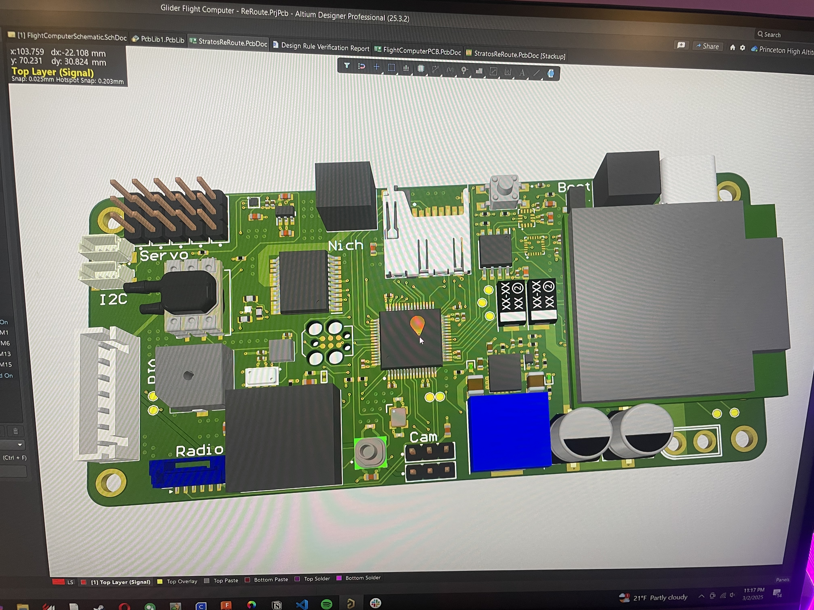

# StratosFlightComputer
Descrition: **Flight control system completely designed from scratch.** Created for an extreme high altitude glider (120,000ft) as part of a Princeton Rocketry project.

**This project is still a work in progress**

## Project Summary
 - **Situation:** This glider project is an evolution of a finalist project for the NASA FLOATing DRAGON Balloon Challenge. It is a sub 4lb glider that is brought to ~120,000ft using a high altitude balloon that is then dropped to collect upper atmosphere data and test novel navigation algorithms and simulations.
 - **Task:** The team needed an extremely powerful onboard computer to collect and process data on the fly, and also navigate the glider back to Princeton from 120,00ft for recovery.
 - **Action:** I designed a flight computer in Altium to meet all of the requirements of the team.
 - **Results:** The board is being manufactured, so we will see.

## Repository Structure
 - **Hardware** - Contains PCB gerber files, schematic documents, and images
 - **Software** - Contains sensor drivers and necessary code to run the flight computer (Currently still initializiing project in STM32CubeIDE)
 - **Data** - Contains data collected and processed by the flight computer (This will be populated once the PCB is manufactured and flown)

## TODO
 - [ ] Create hardware block diagram
 - [ ] Create software block diagram
 - [ ] Calibration/ Testing
 - [ ] Record some Data
